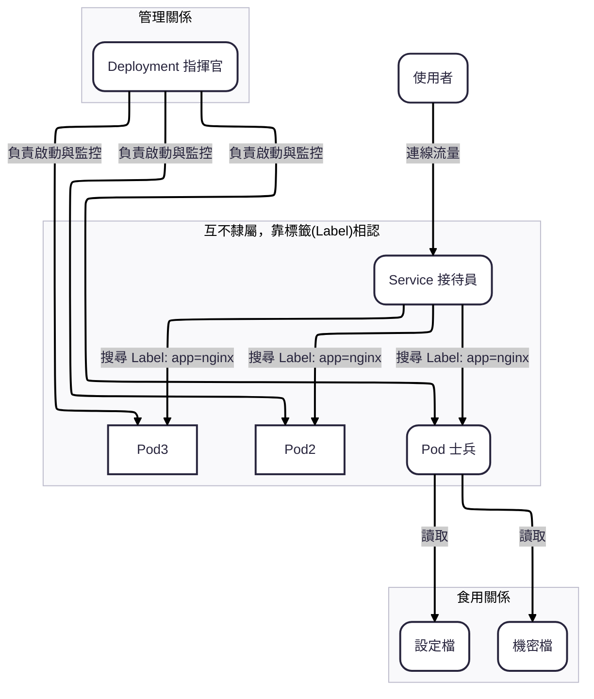

# Kubernetes CKA 學習筆記 Part3 - 網路模型、資源關係與運作原理
  
**範圍:** Service Port 解析 ~ GitOps 觀念釐清  
**date:** 2025-12-05

---

## 1. Service 的 Port 三兄弟：流量是如何流動的？

這是 K8s 網路轉發的核心，切勿搞混 `port`, `targetPort`, `nodePort` 的定義。

### 觀念對照表

| 設定欄位             | 角色比喻           | 定義                              | 對象                          | 所在網域 (SRE 視角)                  |
| :--------------- | :------------- | :------------------------------ | :-------------------------- | ------------------------------ |
| **`nodePort`**   | **警衛室窗口** (入口) | 開在 **實體機器 (Node)** 上的 Port。     | 給 **外部使用者** 連線用。            | **Node Network** (真實世界，外部可達)   |
| **`port`**       | **總機號碼** (轉接)  | 開在 **Service (虛擬 IP)** 上的 Port。 | 給 **Cluster 內部其他 Pod** 連線用。 | **Service Network** (虛擬世界，僅內網) |
| **`targetPort`** | **分機號碼** (終點)  | 開在 **Pod (Container)** 裡的 Port。 | 給 **應用程式 (App)** 聽的。        | **Pod Network** (Overlay 內網)   |

### 流量路徑 (Traffic Flow)
1.  **外部使用者** ➜ `NodeIP:30006` (**nodePort**)
2.  **K8s 內部轉發** ➜ `ServiceIP:80` (**port**)
3.  **負載平衡** ➜ `PodIP:8080` (**targetPort**) ➜ **Container**
User -> `NodeIP:nodePort` -> (NAT) -> `ServiceIP:port` -> (LoadBalance) -> `PodIP:targetPort`
### ⚠️ CKA 考點
*  **鐵律：`targetPort` (Service) 必須 = `containerPort` (Deployment)。**，否則連線會被拒絕 (Connection Refused)。
* 若未指定，`targetPort` 預設等於 `port`。
* Debug 時先查 `k get ep` (Endpoints)，確認 Service 有沒有找到後面的 Pod IP。

---

## 2. 服務暴露：Apply vs Expose

這兩個指令都能讓服務跑起來，但適用場景截然不同。

| 特性 | `kubectl apply` | `kubectl expose` |
| :--- | :--- | :--- |
| **定位** | **萬能施工隊 (宣告式)** | **開窗工人 (指令式)** |
| **功能** | 建立/更新 所有資源 (Deploy, SVC, CM...) | **只能建立 Service** |
| **依賴** | YAML 檔案 | 現有的 Pod/Deployment |
| **更新能力** | ✅ 可更新 (Update/Patch) | ❌ 不可更新 (報錯 Already Exists) |

### 💡 考試必殺技 (混用大法)
手寫 Service YAML 很痛苦（要寫 Selector）。
1.  先用 `expose` 自動抓取 Deployment 的 Label 並生成 YAML：
```bash
kubectl expose deploy nginx --port=80 --target-port=80 --name=my-svc --type=NodePort --dry-run=client -o yaml > svc.yaml
```
2.  再用 `apply` 進行部署與管理。

---

## 3. K8s 資源與 YAML 的關係

K8s 資源真的依賴 YAML 嗎？
* **技術上 (No)：** API Server 只看懂 JSON/二進位資料。所有資源都可以用指令 (`kubectl run`, `create`) 憑空建立。
* **管理上 (Yes)：** 為了 **人類閱讀方便**、**版本控制** 與 **處理複雜設定**，SRE 高度依賴 YAML。

**比喻：**
* YAML = **菜單** (給人看)
* K8s 物件 = **端上來的菜** (實際存在的東西)
* 你可以直接跟廚師點菜 (CLI)，但為了餐廳營運，通常還是看菜單 (YAML)。

---

## 4. 資源相依性圖解 (Who eats Who?)

釐清 Pod, Deployment, Service, ConfigMap 之間的關係。

### ❌ 常見誤區
* **錯誤：** Service 去吃 Deployment？ Service 去啟動 Pod？
* **正確：** Service 根本不認識 Deployment。**Service 只認 Label (標籤)。**

### ✅ 正確關係圖
1.  **Deployment (工頭) ➜ Pod (工人)**：負責生小孩、維持數量、重啟。
2.  **Service (總機) ➜ Pod (工人)**：透過 **Label Selector** 搜尋有上班的工人，把流量導過去。
3.  **Pod (工人) ➜ ConfigMap/Secret (便當)**：
    * **ConfigMap:** 普通便當 (公開參數)。
    * **Secret:** 加密便當 (機密參數，Base64 編碼，存於記憶體)。



### 其他指揮官 (Workloads)
* **StatefulSet:** 有狀態的應用 (資料庫)。
* **DaemonSet:** 每個 Node 都要跑一隻 (監控 Agent)。
* **Job/CronJob:** 跑完就結束的任務 (批次處理)。

---

## 5. K8s 網路模型：IP 分配與溝通

K8s 預設讓所有 Pod 互通 (Flat Network)，目的是 **去除 NAT 的複雜度**。

### IP 怎麼分配不衝突？ (CIDR 機制)
採用 **「切蛋糕」** 策略：
1.  **Cluster CIDR:** 設定一個超大網段 (如 `10.244.0.0/16`)。
2.  **Node CIDR:** Controller Manager 切一小塊給每個 Node (如 Node A 拿 `10.244.1.0/24`)。
3.  **Pod IP:** Node 上的 CNI 插件從該 Node 的網段中發 IP 給 Pod。
* **結果：** 物理上不可能衝突。

### 網路 API 三劍客
1.  **Service:** Layer 4 (TCP/UDP)。負責**負載平衡**與**穩定 IP**。
2.  **Ingress:** Layer 7 (HTTP/HTTPS)。負責**網域路由** (分流)。
3.  **NetworkPolicy:** 防火牆。負責**限制連線** (誰可以連誰)。

---

## 6. GitOps 觀念：Apply vs Git

不要誤以為 `kubectl apply` 負責檔案管理。

* **Git:** 負責 **「文件管理」** (版本控制、歷史紀錄、備份)。 -> **建築師/檔案室**
* **kubectl apply:** 負責 **「狀態同步」** (把 YAML 變成現實)。 -> **工頭**

**SRE 實務流程：**
1.  在 **Git** 中修改 YAML (版控)。
2.  執行 **Apply** 同步狀態 (施工)。
3.  若要 Rollback，是去 Git 找舊檔案再 Apply，而不是指望 Apply 有復原鍵。